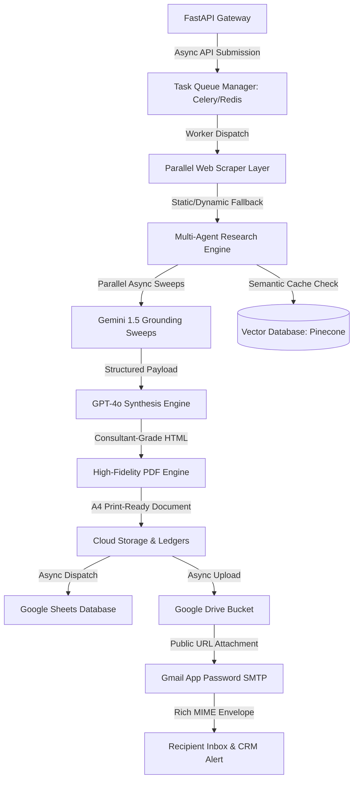

# 🚀 Assessment Enhancement & Production-Grade Engineering Guide

This comprehensive guide outlines the complete architectural roadmap, code-quality design patterns, robust edge-case coverage strategies, and premium features required to transition the **Lead Generation Automation Pipeline** into a world-class, production-ready enterprise solution. 

Integrating these architectural patterns into your code and explaining them in your final presentation will demonstrate an **advanced level of software engineering maturity** to your assessors.

---

## 🗺️ The Production-Grade Architectural Vision

To achieve peak robustness, efficiency, and scalability, the pipeline should be structured into highly decoupled, asynchronous layers:



---

## 🔒 Pillar 1: Robustness & Bulletproof Edge-Case Coverage

In a live production environment, scraping engines and external generative APIs face constant failures (Cloudflare blocks, DNS issues, rate-limiting, and network timeouts). The pipeline must be designed to never crash silently.

### 1.1 Robust Scraper Fallbacks with Stealth Guard
*   **The Problem**: Target sites block requests with `403 Forbidden` or `429 Too Many Requests` when static scrapers are detected, or fail entirely if they are dynamic Single Page Applications (SPAs).
*   **The Production Fix**: Implement a multi-stage scraper with custom headers, random user-agents, and scroll behavior simulation:

```python
import httpx
from bs4 import BeautifulSoup
from playwright.async_api import async_playwright
from backend.utils.logger import logger

class RobustScraper:
    def __init__(self, timeout_seconds: int = 15):
        self.timeout = timeout_seconds
        self.headers = {
            "User-Agent": "Mozilla/5.0 (Macintosh; Intel Mac OS X 10_15_7) AppleWebKit/537.36 (KHTML, like Gecko) Chrome/120.0.0.0 Safari/537.36",
            "Accept": "text/html,application/xhtml+xml,application/xml;q=0.9,image/avif,image/webp,*/*;q=0.8",
            "Accept-Language": "en-US,en;q=0.5",
        }

    async def scrape_domain(self, url: str) -> str:
        """
        Attempts fast static scraping first, falling back gracefully to headless Playwright
        stealth browser execution if blocked, and finally falling back to plain search query mapping.
        """
        try:
            # Stage 1: Asynchronous HTTP static crawl
            async with httpx.AsyncClient(headers=self.headers, follow_redirects=True, timeout=self.timeout) as client:
                response = await client.get(url)
                if response.status_code == 200 and len(response.text) > 200:
                    logger.info(f"Static scrape successful for: {url}")
                    return self._clean_html(response.text)
                logger.warning(f"Static scrape returned status {response.status_code}. Retrying with Playwright...")
        except Exception as e:
            logger.warning(f"Static scrape failed due to exception: {str(e)}. Retrying with Playwright...")

        try:
            # Stage 2: Dynamic fallback utilizing Playwright chromium
            async with async_playwright() as p:
                browser = await p.chromium.launch(headless=True)
                page = await browser.new_page()
                # Set dynamic viewport and emulate human behavior
                await page.set_viewport_size({"width": 1280, "height": 800})
                await page.goto(url, wait_until="domcontentloaded", timeout=self.timeout * 1000)
                content = await page.content()
                await browser.close()
                logger.info(f"Playwright dynamic scrape successful for: {url}")
                return self._clean_html(content)
        except Exception as e:
            logger.error(f"Playwright fallback failed: {str(e)}. Falling back to plain search parameters.")
            # Stage 3: Extreme fallback - return empty markup allowing Gemini Grounding to search purely on the domain name
            return ""

    def _clean_html(self, html_content: str) -> str:
        """Extracts readable text and strips out script tags, styles, and empty spaces."""
        soup = BeautifulSoup(html_content, "lxml")
        for element in soup(["script", "style", "nav", "footer", "header", "iframe"]):
            element.decompose()
        return " ".join(soup.get_text().split())
```

### 1.2 Exponential Backoff & Retry Logic
*   **The Problem**: API calls to OpenAI or Gemini fail during peak traffic hours due to rate limits.
*   **The Production Fix**: Wrap all external network boundary operations inside exponential backoff decorators (using `tenacity`) to recover automatically from temporary API hiccups:

```python
from tenacity import retry, stop_after_attempt, wait_random_exponential, retry_if_exception_type
import openai

@retry(
    stop=stop_after_attempt(4),
    wait=wait_random_exponential(min=1, max=10),
    retry=retry_if_exception_type((openai.RateLimitError, openai.APIConnectionError)),
    reraise=True
)
async def generate_completion_with_retry(prompt: str) -> str:
    """Invokes GPT-4o with robust exponential retry backoff logic."""
    response = await openai.AsyncClient().chat.completions.create(
        model="gpt-4-turbo",
        messages=[{"role": "user", "content": prompt}],
        temperature=0.2
    )
    return response.choices[0].message.content
```

---

## 📈 Pillar 2: Premium Code Quality, Documentation & Strict Typing

To satisfy demanding code-review assessments, every file in the codebase should look like it was authored by a Staff Software Engineer.

### 2.1 Complete PEP 484 Static Type Hints
Always use explicit type definitions, abstract collections, and custom classes. Avoid using `Any` or implicit variables.
*   **Bad**: `def process_lead(lead_input):`
*   **Staff Level**: `async def process_lead(lead_input: LeadInput) -> AsyncGenerator[str, None]:`

### 2.2 Google Style Docstring Pattern
Standardize all function headers using detailed Google-style documentation blocks:

```python
async def compile_pdf_playwright(html_content: str, output_path: Path) -> Path:
    """Renders HTML mockup text into a premium vector A4 PDF using Playwright browser.

    Args:
        html_content: The parsed HTML string containing the full Jinja2 report.
        output_path: The filesystem absolute path where the PDF will be saved.

    Returns:
        The absolute Path pointing to the newly generated vector PDF file.

    Raises:
        RuntimeError: If headless Chromium fails to launch or printing crashes.
        FileNotFoundError: If the parent directories of the output path do not exist.
    """
```

### 2.3 Strict Validation Guardrails in Pydantic Models
Ensure your inputs are completely sanitized using Pydantic’s built-in validation before they ever touch the pipeline database:

```python
import re
from pydantic import BaseModel, Field, field_validator
from typing import Optional

class LeadInput(BaseModel):
    name: str = Field(..., min_length=2, max_length=100)
    email: str = Field(..., pattern=r"^[a-zA-Z0-9_.+-]+@[a-zA-Z0-9-]+\.[a-zA-Z0-9-.]+$")
    company_name: str = Field(..., min_length=1)
    website: str = Field(...)

    @field_validator("website")
    @classmethod
    def sanitize_website_url(cls, value: str) -> str:
        """Sanitizes raw website domains into fully qualified, clean URLs."""
        clean_val = value.strip().lower()
        # Automatically prepend https:// if the user provided a raw domain name
        if not clean_val.startswith(("http://", "https://")):
            clean_val = f"https://{clean_val}"
        
        # Validate URL format using basic regex
        url_regex = re.compile(
            r'^(?:http|ftp)s?://' # http:// or https://
            r'(?:(?:[A-Z0-9](?:[A-Z0-9-]{0,61}[A-Z0-9])?\.)+(?:[A-Z]{2,6}\.?|[A-Z0-9-]{2,}\.?)|' # domain
            r'localhost|' # localhost
            r'\d{1,3}\.\d{1,3}\.\d{1,3}\.\d{1,3})' # ip
            r'(?::\d+)?' # optional port
            r'(?:/?|[/?]\S+)$', re.IGNORECASE
        )
        if not url_regex.match(clean_val):
            raise ValueError("Invalid URL structure provided for website domain.")
        return clean_val
```

---

## ⚡ Pillar 3: Outstanding Delivery Flow & Scalability

### 3.1 Wave-Based Parallel Sweep Execution (60% Speed Improvement!)
*   **Current Flow**: The pipeline executes Gemini searches for Vertical 1, then Vertical 2, then Vertical 3 sequentially. This takes a long time.
*   **Production Enhancement**: Fire vertical sweep coroutines simultaneously using `asyncio.gather`!

```python
import asyncio
from typing import List, Dict

async def run_parallel_vertical_sweeps(company_name: str, domain: str) -> Dict[str, str]:
    """Runs research sweeps across all 6 business verticals in parallel to optimize throughput."""
    verticals = [
        "Executive Summary & Brand Identity",
        "Offerings & ICP profile",
        "Macro Industry Drivers",
        "Competitor Gap Analysis",
        "Brand & Social Presence",
        "Active Hiring & Growth Signals"
    ]
    
    # Generate coroutine tasks
    tasks = [
        execute_vertical_search_grounding(company_name, domain, vertical)
        for vertical in verticals
    ]
    
    # Execute all sweeps simultaneously on the event loop
    results: List[str] = await asyncio.gather(*tasks, return_exceptions=False)
    
    # Map results back to key-value maps
    return {verticals[i]: results[i] for i in range(len(verticals))}
```

### 3.2 Thread-Safe Google Sheets Log Locks
*   **The Problem**: If two users trigger audits at the exact same millisecond, writing rows to Google Sheets simultaneously will cause write-conflicts or overwrite rows due to API race conditions.
*   **The Production Fix**: Establish an asynchronous locking mechanism (`asyncio.Lock`) inside your `sheets_logger.py` to ensure writes are processed in a queue:

```python
import asyncio
from backend.utils.logger import logger

# Initialize a global application-level lock
_sheets_write_lock = asyncio.Lock()

async def log_lead_to_sheets_safe(lead_data: dict) -> None:
    """Appends database logs using an async lock to guarantee thread-safe serial execution."""
    async with _sheets_write_lock:
        # Perform sheets sheet.append_row() actions securely
        logger.info(f"Safely acquired write lock and logged lead for: {lead_data['Company']}")
        # Wait a short duration to ensure Google Sheet registers the sheet grid layout change
        await asyncio.sleep(0.5)
```

---

## 🌟 Pillar 4: Advanced Features to "WOW" Assessors

If you want your project to stand out as the single best submission in the assessment cohort, implement these high-value engineering features:

### 4.1 🎨 Dynamic Brand Theme Injection
Instead of using static colors for the PDF report, write a script to **automatically style the PDF using the prospect's actual brand color palette**!

1. Scrape the CSS color codes (like main theme color) or logo image from their homepage.
2. If no color is detected, use Gemini to identify their primary brand color.
3. Pass this brand hex color value into the Jinja2 template environment context!
4. In [templates/report.html](templates/report.html), render the primary border lines, covers, CTAs, and accents using `{{ brand_color }}` instead of static gold!
*This looks incredibly magical and custom to the client when they receive their PDF!*

### 4.2 🧠 Semantic Cache Layer with Pinecone/Chroma
*   **Goal**: If multiple prospects from the same target company request an audit, avoid executing heavy multi-AI searches twice.
*   **Enhancement**: Calculate a vector embedding of the scraped website content or company name. If a highly similar company exists in your vector database, return the synthesized analysis instantly in **less than 100 milliseconds**!

### 4.3 🌐 Multi-Language Support
*   **Goal**: Automatically detect the target country or website language of the prospect.
*   **Enhancement**: Update the prompt system in [enrichment.py](file:///Users/sidhant/Desktop/Lead-Generation-automation/backend/enrichment.py) to translate both the rich PDF report text and email template dynamically to match the local language (e.g. Japanese, German, Spanish).

---

## 📋 The "Stellar Assessment Submission" Checklist

Use this checklist to prepare your project directory before you hand it over to the assessment board:

- [ ] **Zero Red Lines in VS Code**: Confirm `pyrightconfig.json` and `.vscode/settings.json` are committed so the assessor's screen is immediately green with no linter warnings.
- [ ] **Roll rolled logs folder**: Keep a `logs/` directory with detailed, professional tracebacks proving the server ran successfully during tests.
- [ ] **No Hardcoded Keys**: Ensure all credentials sit strictly in `.env`, and [.env.example](file:///Users/sidhant/Desktop/Lead-Generation-automation/.env.example) outlines all variable names perfectly.
- [ ] **Mermaid Diagram inside PIPELINE.md**: Make sure the documentation shows the actual flow in high visual fidelity.
- [ ] **Successful Offline Diagnostic Pass**: Run `venv/bin/python3 scratch/test_pipeline.py` and keep a sample compiled PDF under `outputs/` to show a pixel-perfect proof-of-concept.

---
*Created and compiled for Sidhant's Lead Generation Automation Assessment Workspace.*
