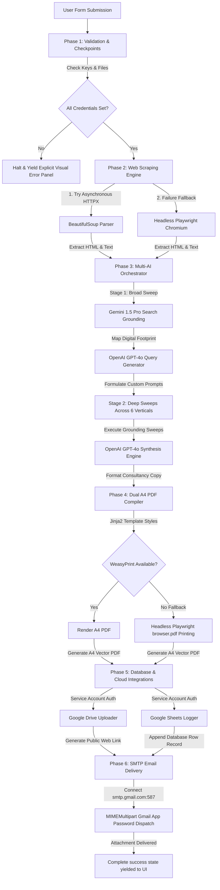

# Pipeline Architecture & Data Flow

This document details the architectural layers and execution sequence of the **Lead Generation Automation Pipeline**.

---

## 🗺️ Visual Architecture Diagram

---

## ⚙️ Detailed Pipeline Stages

### 🔒 Stage 1: Validation & Checkpoints
- **Operations**:
  - Loads configuration settings using Pydantic Settings in `config.py`.
  - Verifies presence of API credentials and Google service account files.
  - Automatically prepends standard web headers (e.g. `https://`) if missing.
- **Error Behavior**:
  - Halts processing instantly upon missing configuration.
  - Logs full tracebacks and yields explicit JSON events to the user interface.

### 🌐 Stage 2: Web Scraping Engine (`scraper.py`)
- **First Sweep (Static)**:
  - Invokes `httpx` asynchronously to pull homepage markup, parsing with `BeautifulSoup4` and `lxml`.
  - Crawls secondary subpages (e.g. `/about`, `/contact`, `/pricing`) if found.
- **Dynamic Fallback (Headless Browser)**:
  - If static requests are blocked (403/429/Cloudflare) or pages are Single Page Applications (SPAs), it spins up a **headless Playwright Chromium** instance.
  - Waits for document paint fonts and fetches dynamic content seamlessly.

### 🤖 Stage 3: Multi-AI Orchestration (`enrichment.py`)
- **Stage A (Broad Sweep)**:
  - Gemini 1.5 Pro uses **Google Search Grounding** to perform a broad sweep across the company name and domain, mapping their digital presence.
- **Stage B (Query Creation)**:
  - GPT-4o processes the scraped markup and Gemini footprint to generate targeted, hyper-specific queries for deep vertical analysis.
- **Stage C (Grounding Sweep)**:
  - Gemini executes these targeted search queries across **6 business verticals**:
    1. Executive Summary & Brand Identity
    2. Offerings & ICP profile
    3. Macro Industry Drivers
    4. Competitor Gap Analysis
    5. Brand & Social Presence
    6. Active Hiring & Growth Signals
- **Stage D (Consulting Synthesis)**:
  - GPT-4o acts as an Executive Consultant, consolidating all data streams to draft a premium, formal copy covering operational pain points, actionable recommendations, and closing calls-to-action.

### 📄 Stage 4: Dual A4 PDF Compiler (`pdf_generator.py`)
- **Layout Styling**:
  - Compiles report copy into a premium Jinja2 [templates/report.html](templates/report.html) using gold/navy print styling, full cover page bleeds, dynamic headers, and running page counters.
- **Rendering Fallback**:
  - Attempts to compile via `WeasyPrint` first.
  - If standard workstation headers (Cairo/Pango dependencies) are missing, it falls back to **headless Playwright**, waiting for fonts to load before printing an exact A4 vector PDF.

### ☁️ Stage 5: Cloud & Database Integrations
- **Google Drive (`drive_uploader.py`)**:
  - Uses GCP Service Account JSON to upload the vector PDF to the designated shared folder.
  - Updates permission settings to make it viewable by "anyone with the link", returning a web share URL.
- **Google Sheets Database (`sheets_logger.py`)**:
  - Appends log details in the next empty row of the Google Sheet, acting as the centralized pipeline ledger.

### ✉️ Stage 6: Gmail App Password SMTP Dispatch (`email_sender.py`)
- **Message Assembly**:
  - Uses standard Python `email` packages to assemble a rich HTML email container.
  - Encodes the generated PDF as a MIME base64 attachment.
- **Transmission**:
  - Connects to Google's SMTP server `smtp.gmail.com:587` over a secure TLS session.
  - Uses your Gmail App Password to instantly dispatch the email, bypassing external SDK fees.
